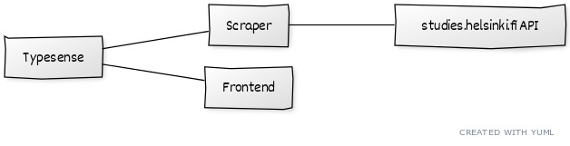

# Course Search

Group name: -

Goal of this project is to create an alternative search engine for https://studies.helsinki.fi/courses where results are shown as you type.
This alternative search engine is intended to provide a user experience that we feel is better than the current one provided by the University of Helsinki.

## System Architecture

Typesense, Scrape and Frontend are each in its own Docker container. The Scraper fetches data from the studies.helsinki.fi API and from the data we pick the relevant data that we push to the Typesense search engine database.

Frontend directly queries data from typesense and displays results.


*A diagram representing the system architecture*

### Typesense

An open source search engine that supports spelling mistakes and instantaneous search from database as you type. [More information here](https://typesense.org/). The interface we expose for the frontend and scraper is the Typesense API, which uses our own schema:

```js
let courseSchema = {
    'name': 'courses',
    'fields': [
    {'name': 'name', 'type': 'string' },
    {'name': 'teachers', 'type': 'string[]', 'facet': true },
    {'name': 'study_level', 'type': 'string' },
    {'name': 'credits', 'type': 'int32' },
    {'name': 'course_code', 'type': 'string' },
    {'name': 'language', 'type': 'string' },
    {'name': 'type', 'type': 'string' },
    {'name': 'degree_programme', 'type': 'string[]' },
    {'name': 'study_track', 'type': 'string[]' },
    {'name': 'is_open_university_course', 'type': 'bool'}
    ],
}
```

### Scraper

Self-built scraper that fetches necessary course information from studies.helsinki.fi. It fetches currently data only for period 1, year 2021. Scraper does type checking to the API data and passes the necessary data from fetched results to Typesense using the schema defined above.

### Frontend

A self built frontend built upon Next.js with React that provides the user interface for search queries and filtering.

## Communication

Communication channel between our services defined in the Architecture picture is http. Currently in development we do not use https, because our service are only available on localhost. If we were to deploy this to a production environment, it would be easy to setup https.

## Pros & Cons

During development we have encountered challenges and successes. Here are few worth mentioning.

### Pros

* Typesense supports small spelling mistakes
* Typesense does search as you type
* Typesense was easy to setup and easy to use
* Typesense has no TypeScript bindings available
* Typescript gave us type safety and it made writing a parser for the courses.helsinki.fi data much easier
* Next.js made setting up the frontend really easy
* There were helper components that made it easy to integrate Typesense to React
* React allowed us to manage UI declaratively, meaning we don't have to make cumbersome manual UI changes
* Ts-auto-guard was silently generating incorrect guard functions if one had accidentally turned the TypeScript strict mode off, we created an issue of this: https://github.com/rhys-vdw/ts-auto-guard/issues/152

### Cons

* studies.helsinki.fi API is limited to 30 results per page, meaning we have to fetch data from all pages in different queries.
    * Implemented naive caching, so that we don't overload the API in development.
    * Initial scraping takes many minutes.
* Typesense schema does not support objects
* studies.helsinki.fi API not made for an alternative search engine, i.e. we have to fetch per peiod, per page.
    * Also fetching study track and all nested information requires many nested requests.
* If studies.helsinki.fi API is not stable, the scraper will crash.
* Had some file syncing problems with docker compose relating to permissions
* No tests in our project to ensure functionality.

## Fallacies

Which of the fallacies of the distributed system does your system violate, and how?
List of fallacies fetched from [Wikipedia](https://en.wikipedia.org/wiki/Fallacies_of_distributed_computing).

- The network is reliable:
    - Yes, because if network stops working we cannot fetch from external API anymore.
- Latency is zero: 
    - No
- Bandwidth is infinite: 
    - Yes, we download a lot of data from the API, but try to query every 2 seconds not to overload the network and server.
- The network is secure: 
    - No, this does not need to be secure, nothing private.
- Topology doesn't change: 
    - No, should not affect the system
- There is one administrator: 
    - No, there is no administrator in our project
- Transport cost is zero:
    - ...
- The network is homogeneous: 
    - No, does not matter

## Extending current architecture & Evaluation of performance

To extend the search engine to support different search data, you need to create a schema for Typesense and create a new scraper for the new API endpoint. In the Frontend service, you need to create new page.

We did not do our own evaluation, but the Typesense is the heaviest component and they have [their own benchmarking](https://github.com/typesense/typesense#benchmarks), which is done properly.
## Future work for improvements

  - Better filtering
  - Better UI and UX
    - Could highlight the matched words within the search results
  - Extend scraper to fetch all periods for year 2021
  - Extend fetching also the faculties based on the course data, so search/filtering can be done more properly
  - Would be great if you could fetch the enrollment links so you could enroll via SISU from our search engine
    - This would require Shibboleth login to UH and/or login tokens from SISU
